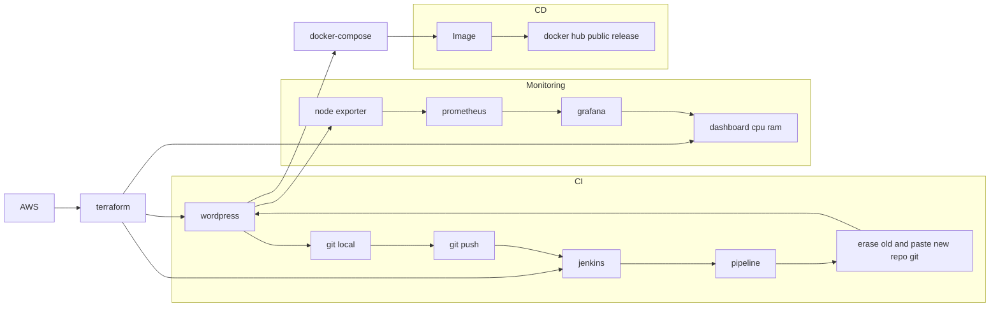

# Born to be Wild
Rozpoczynamy zabawę w tworzenie vmek na aws w celu utworzenia CICD w oparciu o najnowsze technologie devops. Poniżej graph prezentujący wstępne założenia:


## Tworzenie instancji na AWS
Dane techniczne free tier eligible
```
AMI = ami-07d9b9ddc6cd8dd30
instance type = t2.micro
key pair = aws_hosting
security group = vpc-0bb5a3a12797eabae (launch-wizard-1)
volumes = storage 8GiB
```


aws hosting cicd

dzień trzeci, stawiamy jenkinsa. commit....
testujemy commita2.....
STWORZYC DOCKERFILE -> WGRAC DOCKERFILE NA REPO NASZE -> OD STRONY JENKINSA ZROBIC CI (INTEGRACJA GH Z JENKINSEM - zrobione) I CD (POSTAWIENIE KONTENERA NA BAZIE NASZEGO DOCKERFILE)

dalsze testy i kroki....
dalej dalej....
