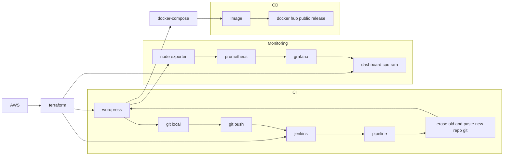

# Born to be Wild
Realizacja wykonania kompletnego CICD od podstaw.


### Konfiguracja instancji aws_wordpress_tf
instalacja skryptów w folderze /wordpress:
```
install.sh
docker-compose.yml
```
### Konfiguracja instancji aws_jenkins_tf
instalacja skryptów:
```
skrypt
```
### Konfiguracja instancji aws_grafana_tf
instalacja skryptów:
```
skrypt
```
### Automatyzacja tworzenia instancji Terraform
Dane techniczne free tier eligible potrzebne do skonstruowania main.ft:
```
AMI = ami-07d9b9ddc6cd8dd30
instance type = t2.micro
key pair = aws_hosting
security group = vpc-0bb5a3a12797eabae (launch-wizard-1)
volumes = storage 8GiB
```
zmienne w main.tf znajdują się w terraform.tfvars.
## MFA
Instalacja na terraform oraz aws cli. \
Skonfigurowanie IAM, grupy, usera na koncie AWS. \
Konfiguracja pliku config w ~/.aws/config. \
Logowanie do konta aws:
```
cd ~/.aws/
aws sso login --profile default
```
oraz sprawdzenie, czy widoczne są instancje:
```
aws ec2 describe-instances --query 'Reservations[*].Instances[*].[InstanceId,InstanceType,State.Name,PublicIpAddress]'
```
Dodanie usera ubuntu do root:
```
sudo usermod -aG root ubuntu
sudo reboot
```
Uruchomienie procesu automatyzacji:
```
cd ~/terraform
terraform init
terraform plan -lock=false
terraform apply -lock=false
```
Do usuwania zasobów:
```
terraform destroy -lock=false
```
jednakże to nie działa na aws.
Automat zwraca public_dns oraz public_ip utworzonych instancji.

notatki:
```
aws hosting cicd

dzień trzeci, stawiamy jenkinsa. commit....
testujemy commita2.....
STWORZYC DOCKERFILE -> WGRAC DOCKERFILE NA REPO NASZE -> OD STRONY JENKINSA ZROBIC CI (INTEGRACJA GH Z JENKINSEM - zrobione) I CD (POSTAWIENIE KONTENERA NA BAZIE NASZEGO DOCKERFILE)

dalsze testy i kroki....
dalej dalej....
```
