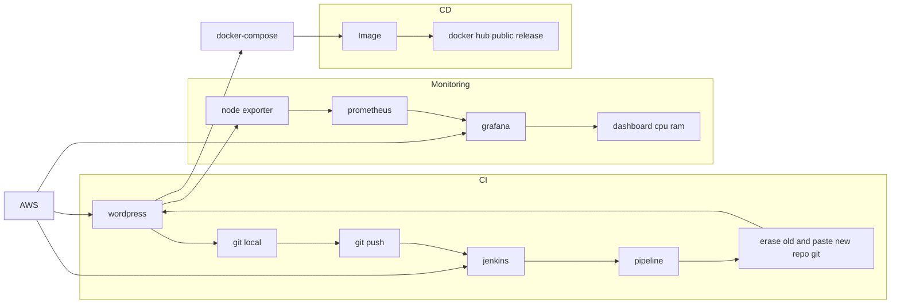

# Born to be Wild

Rozpoczynamy zabawę w tworzenie vmek na aws w celu utworzenia CICD w oparciu o najnowsze technologie devops. Poniżej graph prezentujący wstępne założenia:

aws hosting cicd

dzień trzeci, stawiamy jenkinsa. commit....
testujemy commita2.....
STWORZYC DOCKERFILE -> WGRAC DOCKERFILE NA REPO NASZE -> OD STRONY JENKINSA ZROBIC CI (INTEGRACJA GH Z JENKINSEM - zrobione) I CD (POSTAWIENIE KONTENERA NA BAZIE NASZEGO DOCKERFILE)

dalsze testy i kroki....
dalej dalej....
